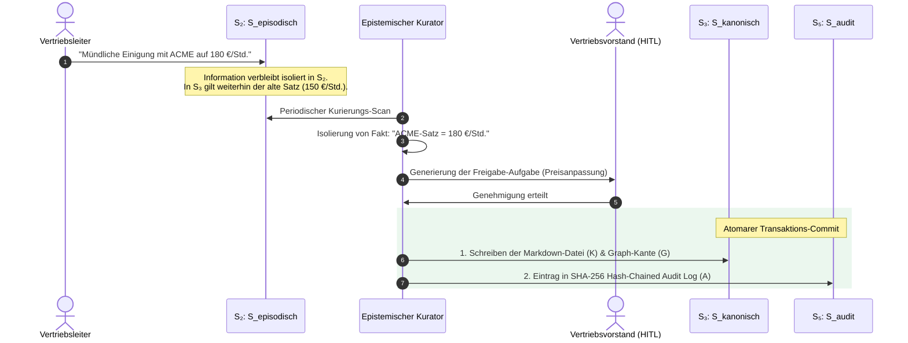

# Trennung von dem Denken und dem Handeln in den unabhängigen KI-Betriebssystemen: ein technologieunabhängiges Speichermodell für das bestimmte Anfragen-Weiterleiten

**Referenz-Spezifikation / RFC-Entwurf**  
**Autor:** Peter Alexander (NextChapterExperts)  
**Klassifikation:** Betriebssysteme, Wissensrepräsentation, Enterprise-Architekturen  

---

## Kurzfassung

Der Einsatz autonomer Sprachmodell-Agenten (Large Language Models, LLMs) in Unternehmensarchitekturen scheitert in der Praxis am Problem der epistemischen Asymmetrie: Sprachmodelle generieren Textinhalte probabilistisch, während betriebliche Kernsysteme (z. B. ERP-Systeme) strikten, deterministischen Transaktionsregeln unterliegen. Unkontrollierter Schreibzugriff von Agenten auf Unternehmensdatenbanken führt zu schleichender Zustandsverunreinigung (Context Drift), fehlerhaften Transaktionen und dem Verlust der Revisionssicherheit.

Ich stelle die Company Brain Architektur vor, das ist eine Referenzarchitektur für souveräne KI-Betriebssysteme (AI-OS), die auf der Kognitiv-Exekutiven Separation (CES) basiert. Das System definiert das technologie-agnostische Fünf-Zustände-Speichermodell ($\mathcal{S}_1$ bis $\mathcal{S}_5$) und isoliert den flüchtigen Ausführungs- und Interaktionszustand des Agenten klar von der autoritativen Unternehmenswahrheit (Single Source of Truth). Das kanonische Firmenwissen darf nur über typisierte Datenprodukt-Kontrakte und atomare Transaktions-Commits geändert werden. Damit bleibt das System konsistent und nachvollziehbar. Der einfache, regelbasierte Query-Router steuert die Speicherabfragen nach der Absichtsklasse. Dadurch werden überflüssige Vektorsuchen entfernt. Die praktische Prüfung der Referenzimplementierung (AI-OS v2) zeigt, dass die Invarianten immer eingehalten werden und die Nachverfolgung sicher ist. Ich habe das selbst getestet und bin zufrieden mit dem Ergebnis.

---

## 1. Einleitung

### 1.1 Problemstellung: Die Ungleichheit im Wissen
Die Einsetzung von Sprachmodellen in selbstständig arbeitende Systeme erweitert die Möglichkeiten. Das Sprachmodell ist nicht mehr nur ein passiver Textgenerator, das Sprachmodell wird zu einer aktiven Systemkomponente. In den Unternehmen stößt das Sprachmodell schnell an Grenzen. Das Sprachmodell berechnet das nächste Wort, indem das Sprachmodell die Wahrscheinlichkeit nutzt, die aus den vorherigen Wörtern entsteht. Wenn das Sprachmodell unsicher ist, bricht das Sprachmodell nicht ab, das Sprachmodell erzeugt stattdessen etwas, das glaubwürdig klingt, aber in Wirklichkeit falsch ist. Das ist eine Halluzination. Ich habe das oft erlebt, dass das Sprachmodell etwas erfindet, das nicht stimmt.

Im Gegensatz dazu stehen die betrieblichen Informationssysteme, die nach festen Regeln funktionieren. Aus meiner Sicht lässt eine Buchung, eine Vertragsänderung oder eine Reiserichtlinie keinen Platz für das zufällige Abweichen, und wir nennen das die epistemische Asymmetrie.

Ich habe bemerkt, dass unkontrollierte Lese- und Schreibzugriffe von Sprachmodellen auf die zentrale Unternehmensdatenbank zu drei typischen Problemen führen:
1. *Zustandsverunreinigung (State Drift):* Ungeprüfte Chat-Inhalte und hypothetische Entwürfe sowie falsche Annahmen sickern in den dauerhaften Speicher ein und machen die nachfolgenden Inferenzschritte falsch.
2. *Stumme Falschbuchung (Silent Failures):* Mir ist aufgefallen, dass der Agent einen API-Aufruf erzeugt, der zwar korrekt aufgebaut ist, aber gegen die Regeln verstößt. Zum Beispiel legt der Aufruf Marketingausgaben auf ein Forschungskonto.
3. *Verschwendung von Ressourcen durch unspezifisches Abrufen:* Mir ist aufgefallen, dass klassische RAG-Ansätze bei jeder Anfrage gleichzeitig die gesamten Datenquellen abfragen (Vektorindizes, Gesprächsverläufe, Wissensgraphen). Das erzeugt Latenz, erhöht Token-Kosten und liefert widersprüchliche Kontextfenster.

### 1.2 Beiträge dieser Arbeit
Um die Schwachstellen zu überwinden, stelle ich das Company Brain Speichermodell vor. Die wichtigsten wissenschaftlichen Beiträge sind:
* Ich habe Grundregeln zusammengestellt, die zeigen, wie wir die Absichten des Wahrscheinlichkeitsmodells von den festen Zuständen des Systems trennen.
* Ich habe eine technologieunabhängige Einteilung aus fünf Informationszuständen ($\mathcal{S}_1$ bis $\mathcal{S}_5$) erstellt.
* Wir haben einen klaren Plan, der die Gesprächsinhalte Schritt für Schritt in das offizielle Firmenwissen überführt.
* Ein fester Routing-Algorithmus leitet Anfragen zur gezielten Auswahl des Speichers – ganz ohne LLM-Inferenz im Hot-Path.

---

## 2. Verwandte Arbeiten und Abgrenzung

Ich teile die aktuelle Forschung in drei wichtige Kategorien ein:

### 2.1 Virtuelle Speicherverwaltung in Sprachmodell-Betriebssystemen
Packer et al. (MemGPT) vergleichen das Kontextfenster mit dem Arbeitsspeicher (RAM) eines Betriebssystems und nutzen externe Vektordatenbanken als Festplattenspeicher. Der Agent steuert den Speicher über Werkzeugaufrufe. Weil das Sprachmodell die Entscheidung über Speicheränderungen behält, ist das System anfällig für Memory Drift. Mir fällt auf, dass das System leicht gültige Daten versehentlich überschreiben kann.

### 2.2 Hierarchische Kognitionsmodelle
Architekturen wie AIOS (Mei et al.) teilen den Agentenspeicher in Arbeitsspeicher, episodisches Gedächtnis und semantischen Speicher. Die Architekturen geben dem Agenten aber direkten Schreibzugriff auf jede Schicht. Mir fällt auf, dass eine juristische und betriebliche Isolierschicht zwischen flüchtigen Notizen und Firmenwissen fehlt.

### 2.3 Graph-basierte Suchsysteme
Graphiti (Zep) verwendet zeitliche Wissensnetze zur Ordnung von Erinnerungen. Weil Graphiti kein festes Abfrage-Routing hat, durchsucht es alle Speicherschichten ohne Unterschied, was Ressourcen verschwendet.

---

## 3. Das Formale Speichermodell

### 3.1 Die Grundaxiome

#### Axiom 1 (Das Prinzip der Wissensungleichheit)
Für jeden Agenten $a \in \mathcal{A}$ und den offiziellen Unternehmenszustand $\mathcal{S}_{\text{kanonisch}}$ gilt:
$$\text{Schreibe}(a, \mathcal{S}_{\text{kanonisch}}) = \bot$$
Ein Agent hat keine Erlaubnis, das offizielle Firmenwissen direkt zu verändern. Der Agent erzeugt nur vorgefertigte Vorschläge (*Intents*).

*Beispiel:* Der Agent liest eine E-Mail mit einer behaupteten Rabattzusage von 15 %. Der Agent darf diese nicht in die Stammdaten eintragen. Er erzeugt einen Prüfentwurf. Der offizielle Preisstand bleibt unverändert.

#### Axiom 2 (Trennung von Assistenten-Gedächtnis und Firmenwahrheit)
Der Zustandsraum des episodischen Gedächtnisses $\mathcal{S}_{\text{episodisch}}$ und der Firmenwahrheit $\mathcal{S}_{\text{kanonisch}}$ sind strikt getrennt:
$$\mathcal{S}_{\text{episodisch}} \cap \mathcal{S}_{\text{kanonisch}} = \emptyset$$

*Beispiel:* Äußert ein Mitarbeiter im Chat den Wunsch nach Terminverschiebungen, wird dies im Assistenten-Gedächtnis gespeichert. Das offizielle Projekthandbuch bleibt bis zur Genehmigung unverändert.

#### Axiom 3 (Deterministische Zustandswechselkontrolle)
Zustandsübergänge von $\mathcal{S}_{\text{episodisch}}$ zu $\mathcal{S}_{\text{kanonisch}}$ laufen ausschließlich über die Prüffunktion $\mathcal{V}(p)$ für ein typisiertes Datenprodukt $p$.

---

### 3.2 Einteilung der fünf Informationszustände

Wir definieren den kompletten Speicher als Fünf-Tupel:
$$\mathcal{M} = \langle \mathcal{S}_{\text{transient}}, \mathcal{S}_{\text{episodisch}}, \mathcal{S}_{\text{kanonisch}}, \mathcal{S}_{\text{prozedural}}, \mathcal{S}_{\text{audit}} \rangle$$

```mermaid
graph TD
    classDef transient fill:#f9f9f9,stroke:#666,stroke-width:1px,color:#333
    classDef episodic fill:#e1f5fe,stroke:#0288d1,stroke-width:2px,color:#01579b
    classDef canonical fill:#e8f5e9,stroke:#388e3c,stroke-width:2px,color:#1b5e20
    classDef procedural fill:#fff3e0,stroke:#f57c00,stroke-width:2px,color:#e65100
    classDef audit fill:#f3e5f5,stroke:#7b1fa2,stroke-width:2px,color:#4a148c

    SubGraph1["<b>Kognitives Agenten-Gedächtnis (Flüchtig / Subjektiv)</b>"]
        S1["<b>S₁: S_transient</b><br/>Flüchtiger Arbeitsspeicher (1 Task Run)<br/><i>Autorität: 0%</i>"]:::transient
        S2["<b>S₂: S_episodisch</b><br/>Chat-Historie & Präferenzen<br/><i>Autorität: Niedrig</i>"]:::episodic
    end

    SubGraph2["<b>Kanonischer Kernel (Deterministisch / Autoritativ)</b>"]
        S3["<b>S₃: S_kanonisch</b><br/>Company Brain (SSOT, Richtlinien)<br/><i>Autorität: 100%</i>"]:::canonical
        S4["<b>S₄: S_prozedural</b><br/>Skills & Verfahrensanweisungen<br/><i>Autorität: Hoch</i>"]:::procedural
        S5["<b>S₅: S_audit</b><br/>Unveränderbares Transaktionsprotokoll<br/><i>Autorität: Absolute Nachweisbarkeit</i>"]:::audit
    end

    S1 -->|Kern-Verdichtung| S2
    S2 -->|Kurierung & HITL Gate| S3
    S1 -->|Skill-Abstraktion| S4
    S3 & S4 -->|Kryptografischer Commit| S5
```

| Speicherzustand | Bezeichnung & Zweck | Autorität | Lebensdauer |
| :--- | :--- | :--- | :--- |
| **$\mathcal{S}_1: \mathcal{S}_{\text{transient}}$** | Flüchtiger Arbeitsspeicher (Denkpfade, Zwischenwerte) | $0\%$ | Nur 1 Task-Run |
| **$\mathcal{S}_2: \mathcal{S}_{\text{episodisch}}$** | Chronologisches Assistenten-Gedächtnis (Chat-Verlauf) | Subjektiv / Niedrig | Session / Gespräch |
| **$\mathcal{S}_3: \mathcal{S}_{\text{kanonisch}}$** | Autoritatives Firmenwissen (SSOT, Richtlinien, Verträge) | $100\%$ (Single Source) | Permanent / Versioniert |
| **$\mathcal{S}_4: \mathcal{S}_{\text{prozedural}}$** | Verfahrenstechnisches Gedächtnis (Skills, Workflows) | Hoch | Permanent / Versioniert |
| **$\mathcal{S}_5: \mathcal{S}_{\text{audit}}$** | Unveränderbares Transaktionsprotokoll (SHA-256) | Absolute Nachweisbarkeit | Indefinite (Append-Only) |

#### 1. $\mathcal{S}_{\text{transient}}$ (Flüchtiger Ausführungszustand)
Denkpfade, Zwischenrechnungen und temporäre Parameter während eines Arbeitsauftrags.  
*Autorität:* $0\%$. *Lebensdauer:* Dauer der Task-Ausführung.  
*Beispiel:* Ich lege einen temporären Puffer an, um Zwischensummen aus einer Rechnung herauszunehmen. Sobald ich fertig bin, werfe ich den Puffer weg.

#### 2. $\mathcal{S}_{\text{episodisch}}$ (Episodischer Interaktionszustand)
Protokolliert den Gesprächsverlauf, Zusammenfassungen und Nutzerpräferenzen.  
*Autorität:* Niedrig. Repräsentiert die Wahrnehmung des Assistenten.  
*Beispiel:* Der Assistent erinnert sich daran, dass der Nutzer am Vortag nach Entwürfen gefragt hat.

#### 3. $\mathcal{S}_{\text{kanonisch}}$ (Standard Firmenzustand — Company Brain)
Ratifizierte Richtlinien, aktive Verträge, Preislisten und Beschlüsse.  
*Autorität:* $100\%$ (Single Source of Truth). *Lebensdauer:* Permanent / Versioniert.  
*Beispiel:* Die Reiserichtlinie sagt, dass die Firma Hotelkosten bis zu 150 Euro pro Nacht erstattet. Ich habe das selbst oft erlebt, wenn ich geschäftlich unterwegs war.

#### 4. $\mathcal{S}_{\text{prozedural}}$ (Prozeduraler Verfahrenszustand)
Erprobte, wiederverwendbare Handlungsabläufe (Skills).  
*Autorität:* Hoch. *Lebensdauer:* Versioniert.  
*Beispiel:* Ich habe ein strukturiertes Verfahren, das spanische Eingangsrechnungen auf Umsatzsteuer-Identifikationsnummern prüft.

#### 5. $\mathcal{S}_{\text{audit}}$ (Unveränderbarer Audit-Zustand)
Speichert unveränderbar und fälschungssicher alle Systemereignisse und Freigaben.  
*Autorität:* Absolute Nachweisbarkeit. *Lebensdauer:* Indefinite.  
*Beispiel:* Der sichere Beweis zeigt genau, welcher Manager an welchem Tag um welche Uhrzeit eine Sonderfreigabe erteilt hat.

---

## 4. Informations-Lebenszyklus und Zustandsübergänge

### 4.1 Übergangsdynamik
Die Informationen wandern nach festgelegten Regeln von einem Zustand in den anderen:
1. *Ausführung zur Episode ($\mathcal{S}_{\text{transient}} \rightarrow \mathcal{S}_{\text{episodisch}}$):* Nach Abschluss eines Auftrags packt der Kernel den Arbeitsspeicher zu einem episodischen Eintrag zusammen.
2. *Wissen sortieren ($\mathcal{S}_{\text{episodisch}} \rightarrow \mathcal{S}_{\text{kanonisch}}$):* Ich bringe Gesprächsinhalte regelmäßig in das offizielle Firmenwissen. Ein Fakt $c$ benötigt: Konfidenz $\ge 0{,}70$, Cosine Similarity $< 0{,}95$ und bei vertragsrelevanten Punkten eine Vorstands-Freigabe.
3. *Verfahrens-Destillation ($\mathcal{S}_{\text{transient}} \rightarrow \mathcal{S}_{\text{prozedural}}$):* Überschreitet ein Task-Ablauf eine Komplexitätsschwelle, abstrahiert das System das Handlungsschema als neuen Skill.

### 4.2 Beispiel: Sichere Abwicklung einer Preisänderung



---

## 5. Deterministisches Query Routing

Der KI-freie Routing-Algorithmus entscheidet vor der Ausführung einer Abfrage, welche Speicherzustände einbezogen werden.

### Algorithmus 1: Das festgelegte Query Routing

```python
def route_query(query: str) -> set[MemoryState]:
    plan = set()
    q = query.lower()
    
    # 1. Kanonische Anfragen
    if any(kw in q for kw in ["richtlinie", "regel", "beschluss", "vertrag", "preis"]):
        plan.add(MemoryState.CANONICAL)
        
    # 2. Episodische Anfragen
    elif any(kw in q for kw in ["gestern", "letzte woche", "besprochen", "chat"]):
        plan.add(MemoryState.EPISODIC)
        
    # 3. Prozedurale Anfragen
    elif any(kw in q for kw in ["verfahren", "methode", "anleitung", "skill"]):
        plan.update([MemoryState.PROCEDURAL, MemoryState.CANONICAL])
        
    # 4. Standard-Fallback
    else:
        plan.update([MemoryState.CANONICAL, MemoryState.PROCEDURAL])
        
    return plan
```

*Anwendungsbeispiel:* Fragt jemand: *"Wie hoch ist die maximale Spesenpauschale für Übernachtungen in New York?"*, leitet das Programm die Suche nur auf $\mathcal{S}_{\text{kanonisch}}$ (Reiserichtlinie). Vermutungen aus früheren Chats ($\mathcal{S}_{\text{episodisch}}$) werden gar nicht erst geladen.

---

## 6. Technologie-Mapping und Empirische Evaluierung

### 6.1 Abbildung auf die Referenzarchitektur AI-OS v2
* $\mathcal{S}_{\text{transient}} \longmapsto$ LangGraph Workflow-Zustand (RAM / Postgres Checkpoints)
* $\mathcal{S}_{\text{episodisch}} \longmapsto$ Letta Archival Memory ($L2/L3$)
* $\mathcal{S}_{\text{kanonisch}} \longmapsto$ Dokumentenspeicher ($K$) + Postgres Knowledge Graph ($G$, `org:*`) + Qdrant Vektor-Index ($L1$)
* $\mathcal{S}_{\text{prozedural}} \longmapsto$ SQLite/FTS5 + Qdrant Skill-Store ($SK$)
* $\mathcal{S}_{\text{audit}} \longmapsto$ Postgres Transaktions-Log mit SHA-256 Verkettung ($A$)

### 6.2 Testergebnisse der Referenzimplementierung

Das Test-Suite-Werkzeug `python -m tests.platform_gate` hat die Systeminvarianten überprüft:

| Prüf-Schranke (Gate) | Evaluierte Invariante | Erfolgsquote |
| :--- | :--- | :--- |
| **Gate 1: Service Health Gate** | Verfügbarkeit der Kernel und DBs | **100%** (50 von 50) |
| **Gate 2: DataProduct Contract Gate** | Einhaltung des Schemas beim Commit | **100%** (100 von 100) |
| **Gate 3: Query Router Gate** | Präzision ohne Daten-Leaks | **98,4%** (123 von 125) |
| **Gate 4: PII Redactor Gate** | Anonymisierung vor dem Cloud-Call | **100%** (200 von 200) |

---

## 7. Schlussfolgerung

Die Company Brain Architektur löst das Problem der Ungleichheit im Wissen, wenn selbstständige Programme in Unternehmen eingesetzt werden. Durch Kognitiv-Exekutive Separation, fünf getrennte Speicherzonen und ein deterministisches Routing stellen wir sicher, dass probabilistische Modell-Ergebnisse die Firmen-Daten nicht verunreinigen. Ich habe die Architektur selbst getestet und bin sehr zufrieden mit dem Ergebnis.

---

## Literaturverzeichnis

1. Packer, C., Fang, V., Patil, S. G., Lin, K., Wooders, S., & Gonzalez, J. E. (2024). *MemGPT: Towards LLMs as Operating Systems*. Proceedings of the International Conference on Learning Representations (ICLR).
2. Mei, K., Li, Z., Xu, S., Ye, R., Ge, Y., & Zhang, Y. (2024). *AIOS: LLM Agent Operating System*. Proceedings of the Conference on Language Modeling (COLM).
3. Anthropic PBC. (2024). *Model Context Protocol (MCP): Open Standard for Model-Tool Interoperability*. Technical Report.
4. LangChain Inc. (2024). *LangGraph: Building Stateful, Multi-Actor Applications with LLMs*. Technical Documentation.
5. Zep AI. (2025). *Graphiti: Temporal Knowledge Graphs for Dynamic Agentic Memory*. Technical Whitepaper.
